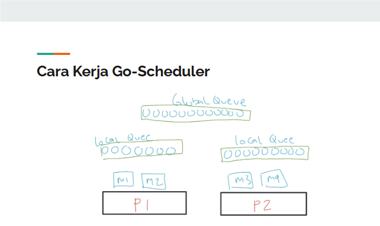

# Goroutines

## Pengenalan Concurrency dan Parallel Programming

Concurrency dan parallel programming adalah dua konsep penting dalam pemrograman yang sering digunakan untuk meningkatkan performa aplikasi.

### Concurrency
Concurrency adalah kemampuan untuk menjalankan beberapa tugas secara bersamaan, meskipun tidak selalu secara paralel. Dalam konteks pemrograman, ini berarti bahwa beberapa goroutine dapat berjalan pada saat yang sama, tetapi tidak harus dieksekusi pada inti CPU yang berbeda.

### Parallel Programming
Parallel programming adalah kemampuan untuk menjalankan beberapa tugas secara bersamaan pada inti CPU yang berbeda. Ini memungkinkan program untuk memanfaatkan sumber daya hardware secara lebih efisien, terutama pada sistem multi-core.

Perbedaan utama antara concurrency dan parallel programming adalah bahwa concurrency fokus pada struktur program yang memungkinkan beberapa tugas berjalan bersamaan, sedangkan parallel programming fokus pada eksekusi tugas-tugas tersebut secara simultan pada hardware yang mendukung.

Parallel Programming pasti konteksnya adalah multi-thread sedangkan concurrency tidak harus multi-thread. Concurrency bisa terjadi dalam satu thread dengan menggunakan goroutine, sedangkan parallel programming memerlukan beberapa thread atau proses yang berjalan secara bersamaan.

Tabel contoh nyata concurrency dan parallel programming di dunia nyata:
```
+-----------------+-----------------+
|    Concurrency  | Parallel        |
|                 | Programming      |
+-----------------+-----------------+
| Antrian Layanan | Proses Produksi |
| Pelanggan       | Barang di Pabrik|
| Penjadwalan     | Pengolahan Data |
| Tugas           | Besar            |
+-----------------+-----------------+
```

### CPU-bound vs I/O-bound
CPU-bound dan I/O-bound adalah dua jenis tugas yang berbeda dalam konteks pemrograman.
- **CPU-bound**: Tugas yang membutuhkan banyak waktu CPU untuk menyelesaikan, seperti perhitungan matematis kompleks atau pemrosesan data besar. Tugas-tugas ini biasanya memanfaatkan banyak sumber daya CPU dan dapat dioptimalkan dengan menggunakan parallel programming.
- **I/O-bound**: Tugas yang lebih banyak bergantung pada operasi input/output, seperti membaca atau menulis file, mengakses database, atau melakukan permintaan jaringan. Tugas-tugas ini biasanya tidak memerlukan banyak waktu CPU dan dapat dioptimalkan dengan menggunakan concurrency untuk menghindari blocking saat menunggu operasi I/O selesai.

# Pengenalan Goroutine
Goroutine adalah unit eksekusi ringan dalam bahasa pemrograman Go yang memungkinkan kita untuk menjalankan fungsi secara bersamaan. Goroutine dikelola oleh runtime Go, yang membuatnya lebih efisien dibandingkan dengan thread tradisional.

Ukuran goroutine sangat kecil sekitar 2KB. Sedangkan thread ukurannya 1mb.

Perbedaan utama antara goroutine dan thread adalah bahwa goroutine dikelola oleh runtime Go, sedangkan thread dikelola oleh sistem operasi. Ini memungkinkan goroutine untuk lebih efisien dalam hal penggunaan memori dan sumber daya CPU. Thread berjalan secara paralel sedangkan goroutine berjalan secara concurrency.

### Cara Kerja Goroutine
Goroutine dijalankan oleh Go scheduler dalam thread yang jumlah threadnya sebanyak GOMAXPROCS (biasanya sejumlah core CPU).

Go scheduler akan mengatur goroutine yang berjalan pada thread yang tersedia. Jika ada goroutine yang sedang menunggu operasi I/O, Go scheduler akan memindahkan goroutine lain ke thread yang sama untuk memaksimalkan penggunaan CPU.

Jadi sebenarnya Goroutine tidak bisa dibilang sebagai pengganti thread karena Goroutine berjalan di atas thread. Namun, kita tidak perlu melakukan manajemen thread secara manual karena Go scheduler yang akan mengatur goroutine yang berjalan pada thread yang tersedia.

Dalam Go scheduler, ada beberapa istilah penting yang perlu dipahami:
- **Goroutine (G)**: Unit eksekusi ringan yang dijalankan oleh Go scheduler.
- **Thread/Machine (M)**: Unit eksekusi yang dikelola oleh sistem operasi. Go scheduler akan menjalankan goroutine pada thread yang tersedia.
- **Processor (P)**: Unit eksekusi yang digunakan oleh Go scheduler untuk menjalankan goroutine. P biasanya berjumlah sama dengan jumlah core CPU yang tersedia.

### Konsep Go Scheduler

- Processor (P) memiliki sebuah thread (M) pada pada masing-masing M terdapat queue yang local bahkan global.
- Thread akan menjalankan goroutine (G) yang ada pada local queue dulu sampai habis, baru kemudian mengambil dari global queue.
- Jika semua goroutine pada local queue dan global queue sudah habis, maka thread akan steal goroutine dari queue thread lain.



### Deklarasi Goroutine
```go
func goroutineExample() {
    fmt.Println("Hello from Goroutine")
}

func main() {
    go goroutineExample() // Menjalankan goroutine secara bersamaan
	fmt.Println("Hello from Main")
    time.Sleep(1 * time.Second) // Memberi waktu untuk goroutine selesai sebelum program berakhir
}
```

Hasil dari kode di atas adalah:
```
Hello from Main
Hello from Goroutine
```

Hal ini menunjukkan bahwa goroutine berjalan secara bersamaan dengan fungsi `main`. Namun, karena `main` selesai lebih cepat, kita perlu menambahkan `time.Sleep` untuk memberi waktu bagi goroutine untuk menyelesaikan eksekusinya sebelum program berakhir. Jika kita tidak menambahkan `time.Sleep`, program akan selesai sebelum goroutine memiliki kesempatan untuk dieksekusi sehingga tidak akan terlihat output dari goroutine.

Goroutine mirip dengan asynchronous programming, di mana kita menjalankan fungsi secara bersamaan tanpa harus menunggu fungsi tersebut selesai. Namun, goroutine lebih efisien karena dikelola oleh Go scheduler dan tidak memerlukan overhead yang sama seperti thread tradisional.

NB: Ketika memasang goroutine pada sebuah function, function yang dipasang goroutine tersebut harus memiliki tipe return `void` atau tidak mengembalikan nilai karena nilai return tidak akan ditangkap oleh goroutine. Jika kita ingin menangkap nilai return dari goroutine, kita harus menggunakan channel untuk mengirimkan nilai tersebut dari goroutine ke fungsi utama.

NB: Kode ada di [goroutine.go](./goroutine.go)

## Goroutine Sangat Ringan
Karena ringan, kita bisa membuat ribuan bahkan jutaan goroutine dalam satu program tanpa khawatir akan kehabisan memori atau sumber daya CPU. Ini memungkinkan kita untuk membuat aplikasi yang sangat responsif dan efisien, terutama dalam konteks I/O-bound tasks.
```go
package main
import (
    "fmt"
    "time"
)
func main() {
    for i := 0; i < 1000000; i++ {
        go func(i int) {
            fmt.Println("Goroutine", i)
        }(i)
    }
    time.Sleep(10 * time.Second) // Memberi waktu untuk goroutine selesai sebelum program berakhir
}
```
